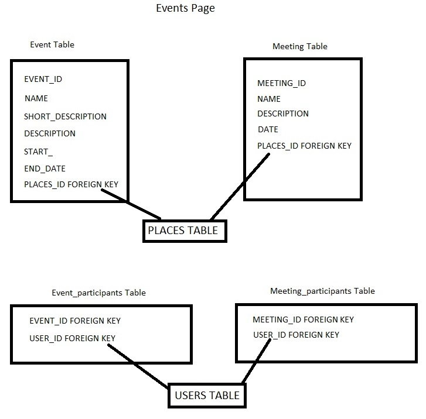

Parts Implemented by Berke Oral
===============================
**Events Page**

Events page has 4 tables in it; event , meeting, event_participants, meeting_participants tables.

In events page users only see the events they participate in.This achived by join operation with users table
and participants table.

.. code-block:: python
        query = """SELECT * FROM EVENT JOIN EVENT_PARTICIPANTS
        ON EVENT_PARTICIPANTS.EVENT_ID = EVENT.EVENT_ID
        WHERE EVENT_PARTICIPANTS.USER_ID = %s
        """
.. code-block:: python
        query = """SELECT * FROM MEETING JOIN MEETING_PARTICIPANTS
        ON MEETING_PARTICIPANTS.MEETING_ID = MEETING.MEETING_ID
        WHERE MEETING_PARTICIPANTS.USER_ID = %s
        """

EVENT_PARTICIPANTS.USER_ID or MEETING_PARTICIPANTS.USER_ID read from session with following code:

.. code-block:: python
        session['USER_ID']

Event and meeting tables is updated with simple update query

When user deletes an event/meeting; First user is deleted from participants list.

.. code-block:: python
         query = """DELETE FROM EVENT_PARTICIPANTS
         WHERE EVENT_ID = %s AND USER_ID = %s"""

Than delete function checks if there is any other participants left

.. code-block:: python
         query = """SELECT * FROM EVENT_PARTICIPANTS
         WHERE EVENT_ID = %s"""

If there is no participants left event/meeting deleted from its table. If there is participant left,
event/meeting remains untouched.

Inside single event/meeting pages user can add new participants from his/her friends list.

Friends of the user fetched with this query:

.. code-block:: python
         query = """
         SELECT * FROM FRIENDS JOIN USERS
         ON FRIENDS.FRIEND_ID = USERS.USER_ID
         WHERE PERSON_ID = %s"""

Fetched friends offered to user as drop down menu

