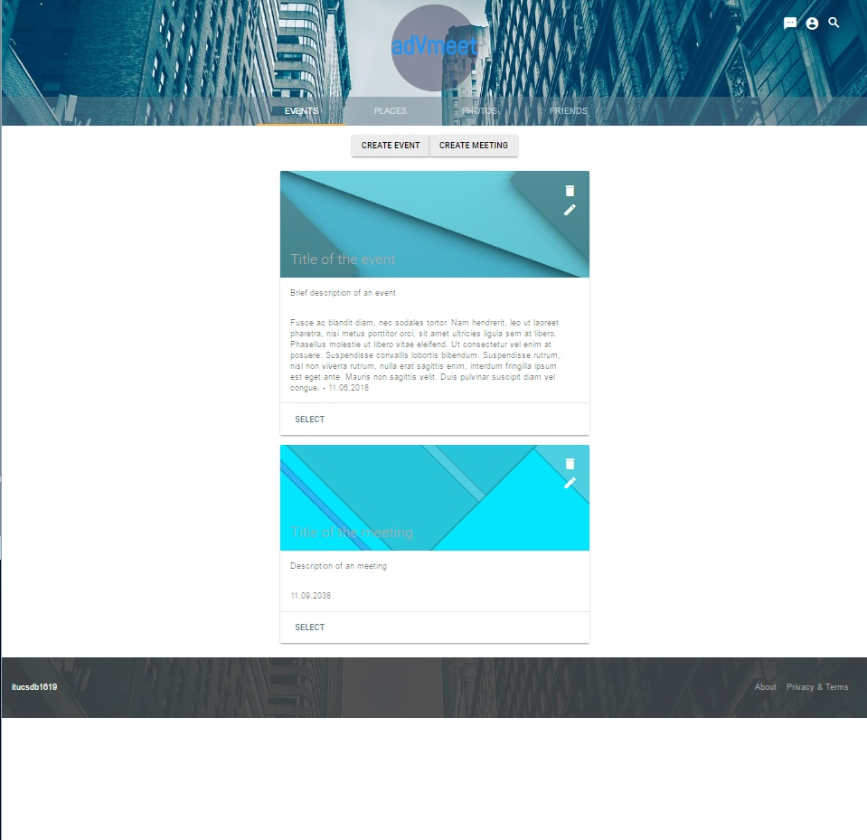
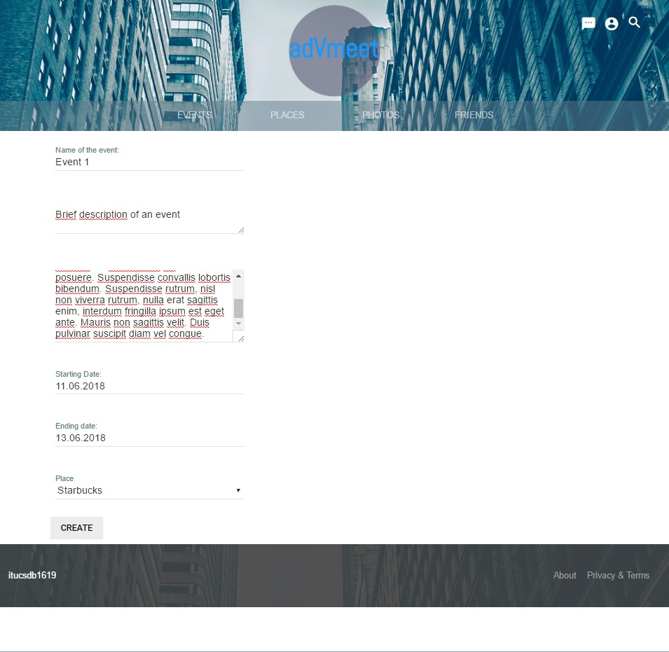
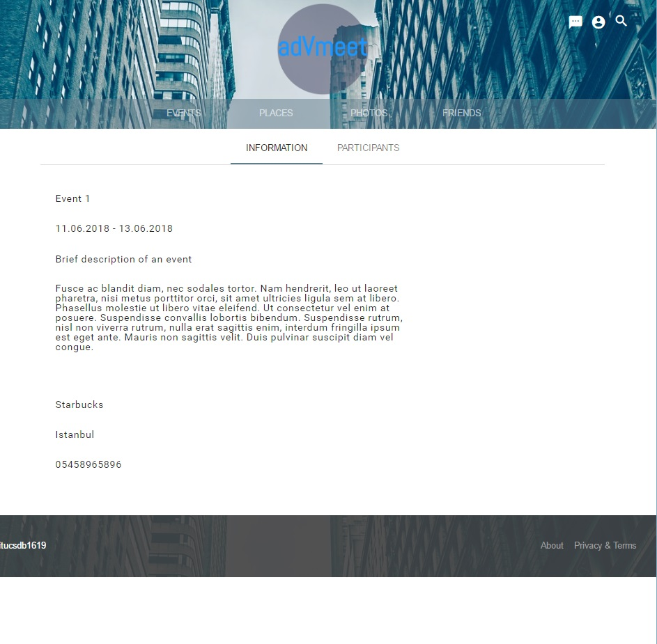

Parts Implemented by Berke Oral
===============================
**Events**

Events page shows all events and meetings which user participates.In this page user can create event or meeting.
User also can view, edit or delete events or meetings.

When event or meeting created, user which creates it is automaticly added into participants.Every participant
can see the event.

Every participant can add his/her friends to participants.

.. image:: add_participant.jpg
   :scale: 50 %
   :alt: map to buried treasure

Also every participant can edit the event.

.. image:: edit_event.jpg
   :scale: 50 %
   :alt: map to buried treasure

Users can delete an event or meeting, however they only removed from participants list.Event itself only removed from database
when there is no participant of that event left.